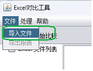
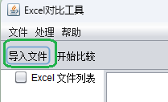
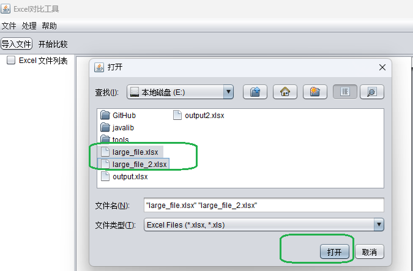
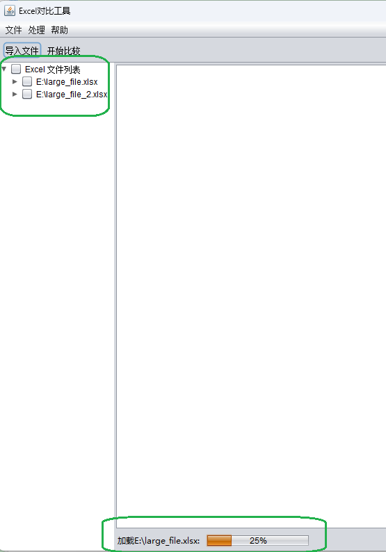
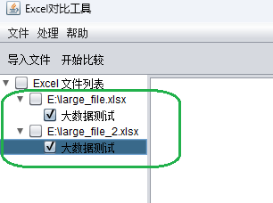
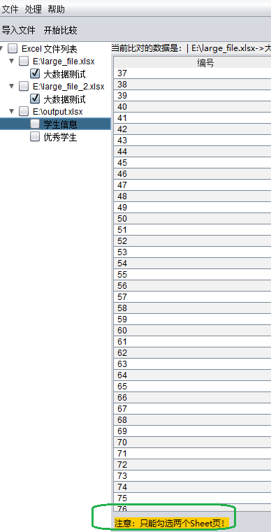
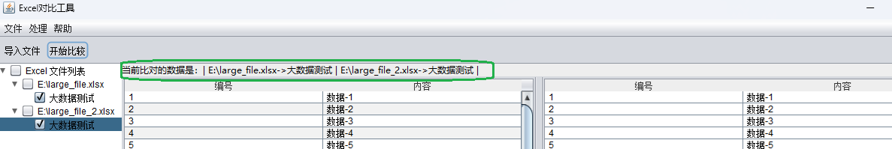
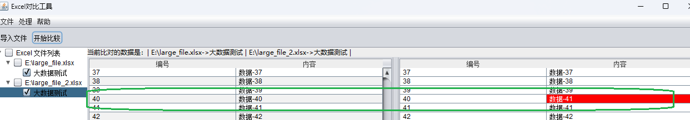

# 工具使用说明

## 快速开始
1. 双击运行程序。
2. 在文件菜单或者工具栏点击【导入文件】

3. 在弹出的文件选择对话框中选择你要导入的文件

4. 文件导入过程中，请在状态栏查看导入进度

5. 导入完成之后，在左侧导航栏勾选你要比对的文件，最多选择2个，多的话，会在状态栏有提示信息

6. 在处理菜单或工具栏点击【开始比较】，表格上方显示左侧和右侧表格内容的来源

7. 如果有匹配不上的数据，会以红色标注

## 注意事项
- 支持 .xls、.xlsx 格式。
- 支持百万级数据的导入和比较。
